# Nano Banana Prompts Workshop

A comprehensive prompt engineering workshop demonstrating advanced image generation techniques using Google's Gemini 2.5 Flash Image Preview model. This project showcases various prompting strategies for creating photorealistic images, illustrations, product photos, and image editing through structured prompt templates.

## Setting Up

Install dependencies and set up the environment:

```sh
uv sync
```

You'll need to set up your Google AI API key as an environment variable:

```sh
export GOOGLE_API_KEY="your-api-key-here"
```

## How To Run

Run the Jupyter notebook to see all examples:

```sh
uv run jupyter notebook src/main.ipynb
```

## Prompt Categories

### 1. Photorealistic Images

Using the `REALISTIC_PROMPT_TEMPLATE` for cinema-quality images:

```python
REALISTIC_PROMPT_TEMPLATE = """
A photorealistic {shot_type} of {subject}, {action_or_expression}, set in
{environment}. The scene is illuminated by {lightning_description}, creating
a {mood} atmosphere. Captured with a {camera_details}, emphasizing
{key_textures_and_details}. The image should be in a {aspect_ratio} format.
"""
```

| Image                                                  | Prompt                                                                                                                                                                                                                                                                                                                                                                                                                                                                                                                                                                              |
| ------------------------------------------------------ | ----------------------------------------------------------------------------------------------------------------------------------------------------------------------------------------------------------------------------------------------------------------------------------------------------------------------------------------------------------------------------------------------------------------------------------------------------------------------------------------------------------------------------------------------------------------------------------- |
| 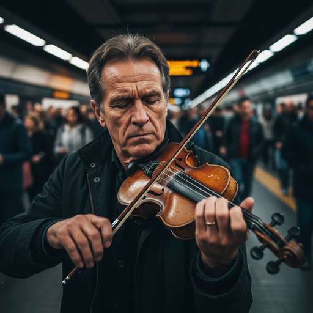 | **Urban Portrait**: A photorealistic close-up portrait of a weathered street musician in his 60s, playing a worn violin with eyes closed in deep concentration, set in a bustling subway station during rush hour. The scene is illuminated by warm artificial tunnel lighting mixed with cool fluorescent overhead lights, creating a contemplative and melancholic atmosphere. Captured with a 85mm lens at f/1.4 with shallow depth of field, emphasizing the deep lines in his face, scratched violin wood, and blurred commuter movement. The image should be in a 3:4 format. |
| 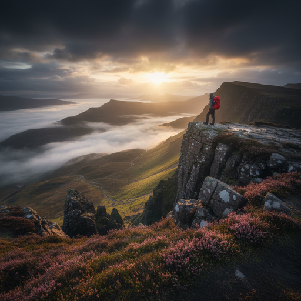 | **Mountain Hiker**: A photorealistic wide shot of a determined female hiker in her 30s, adjusting her backpack while looking towards a distant mountain peak, set in rugged alpine terrain during golden hour. The scene is illuminated by warm, directional sunset light filtering through mountain mist, creating an adventurous and inspiring atmosphere. Captured with a 24mm wide-angle lens at f/8 for maximum sharpness, emphasizing the weathered hiking boots, textured rock formations, and dramatic sky. The image should be in a 16:9 format.                           |
| 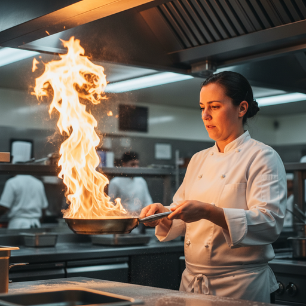 | **Chef Portrait**: A photorealistic medium shot of a focused chef in his 40s, carefully plating a gourmet dish with tweezers, set in a modern professional kitchen during evening service. The scene is illuminated by bright overhead kitchen lighting with warm accent lighting from heat lamps, creating a intense and concentrated atmosphere. Captured with a 50mm lens at f/2.8, emphasizing the chef's concentrated expression, steam rising from hot plates, and intricate food details. The image should be in a 4:3 format.                                               |
| 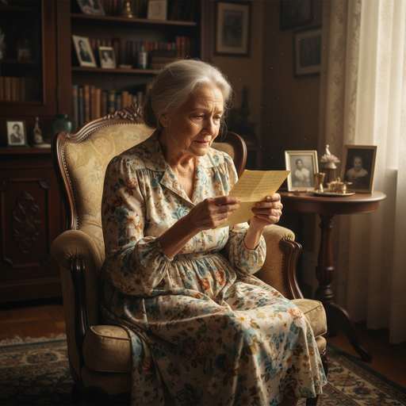 | **Scholar Study**: A photorealistic close-up of an elderly scholar in his 70s, reading an ancient manuscript by candlelight, set in a wood-paneled library filled with leather-bound books. The scene is illuminated by warm, flickering candlelight creating dramatic chiaroscuro lighting, creating a mystical and contemplative atmosphere. Captured with a 85mm lens at f/1.8 for shallow depth of field, emphasizing the weathered hands, aged parchment texture, and golden light dancing on book spines. The image should be in a 3:4 format.                                |
| 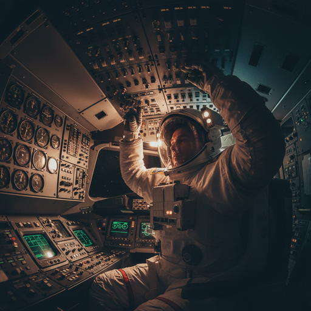 | **Underground Explorer**: A photorealistic medium shot of a cave explorer in protective gear, examining ancient cave paintings with a headlamp, set in a vast underground cavern system. The scene is illuminated by the focused beam of LED headlamps cutting through darkness, with subtle ambient cave lighting, creating a mysterious and archaeological atmosphere. Captured with a 35mm lens at f/4 for good depth of field, emphasizing the textured cave walls, weathered exploration equipment, and ancient artwork details. The image should be in a 16:9 format.         |

### 2. Illustrations

Using the `ILLUSTRATIONS_PROMPT_TEMPLATE` for various artistic styles:

```python
ILLUSTRATIONS_PROMPT_TEMPLATE = """
A {illustration_style} of a {subject}, featuring {key_characteristics} and a
{color_palette}. The design should have {line_style} and {shading_style}.
"""
```

| Image                                            | Prompt                                                                                                                                                                                                                                                                                                                                                                                                                                                                                                                 |
| ------------------------------------------------ | ---------------------------------------------------------------------------------------------------------------------------------------------------------------------------------------------------------------------------------------------------------------------------------------------------------------------------------------------------------------------------------------------------------------------------------------------------------------------------------------------------------------------- |
| 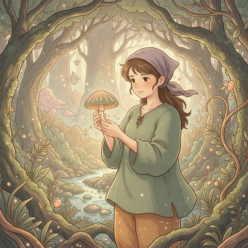 | **Studio Ghibli Style**: A retro anime-style illustration in the spirit of Studio Ghibli of a young botanist examining a glowing mushroom in an enchanted forest, featuring soft facial features, earth-toned clothing, gentle expression, mystical forest elements and a muted sage greens and warm ochres with subtle lavender and copper accents. The design should have soft, organic line work with gentle curves and natural flow and soft cel-shading with warm ambient lighting and delicate shadow gradients. |
| 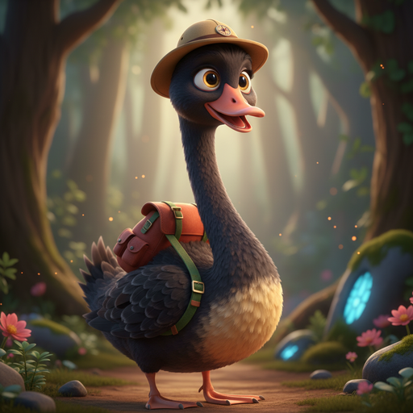 | **Art Nouveau Style**: A flowing Art Nouveau illustration of an elegant woman with flowing hair surrounded by ornate floral patterns, featuring graceful curves, decorative botanical elements, and intricate details with a rich jewel tones of emerald, sapphire, and gold with deep burgundy accents. The design should have bold, sinuous line work with ornamental flourishes and gradient shading with metallic highlights and organic shadow patterns.                                                          |
| 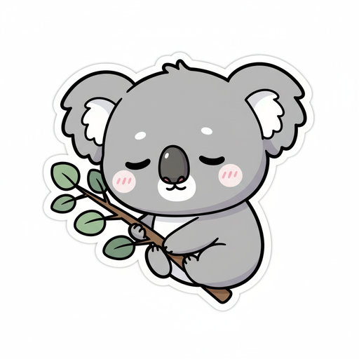 | **Minimalist Line Art**: A clean minimalist line illustration of a modern cityscape at sunset, featuring geometric buildings, simple architectural forms, and negative space usage with a monochromatic palette of warm grays and soft orange sunset tones. The design should have precise, thin line work with geometric precision and flat color blocking with subtle gradient transitions.                                                                                                                          |
| 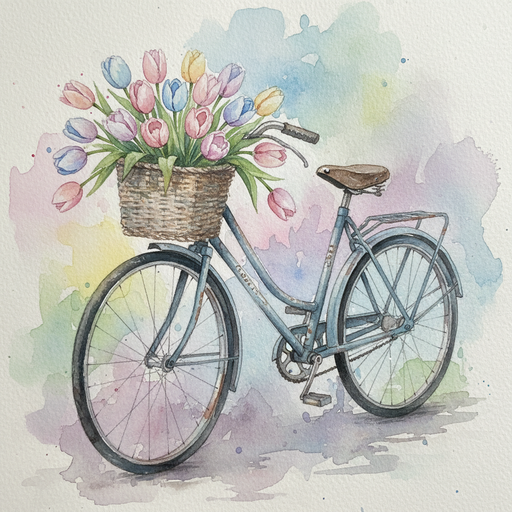 | **Watercolor Style**: A loose watercolor illustration of a vintage bicycle with a basket of flowers in a European cobblestone street, featuring soft edges, organic paint bleeding, delicate flower details, and atmospheric perspective with a soft pastels of dusty rose, sage green, and cream with transparent washes. The design should have fluid, expressive brushstrokes with organic variation and layered transparent washes with natural color bleeding effects.                                            |
| 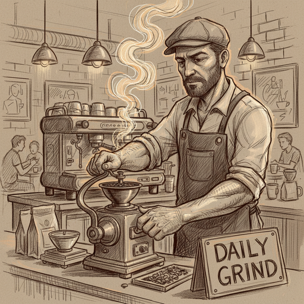 | **Comic Book Style**: A dynamic comic book illustration of a superhero in action pose leaping between skyscrapers, featuring bold character design, dramatic perspective, motion lines, and urban environment with a vibrant primary colors with high contrast and dramatic shadows. The design should have strong, confident line work with varied stroke weights and cell-shaded coloring with dramatic lighting and deep shadows.                                                                                   |

### 3. Product Photography

Using the `PRODUCT_PHOTO_PROMPT_TEMPLATE` for commercial-grade product shots:

```python
PRODUCT_PHOTO_PROMPT_TEMPLATE = """
A high-resolution, studio-lit product photograph of a {product_description}
on a {background_description}. The lighting is a {lighting_setup}, to {lighting_purpose}.
The camera angle is a {angle_type} to showcase {specific_feature}. Ultra-realistic, with sharp
focus on {key_detail}. {aspect_ratio}.
"""
```

| Image                                              | Prompt                                                                                                                                                                                                                                                                                                                                                                                                                                                                                                                                                                                                                                             |
| -------------------------------------------------- | -------------------------------------------------------------------------------------------------------------------------------------------------------------------------------------------------------------------------------------------------------------------------------------------------------------------------------------------------------------------------------------------------------------------------------------------------------------------------------------------------------------------------------------------------------------------------------------------------------------------------------------------------- |
| 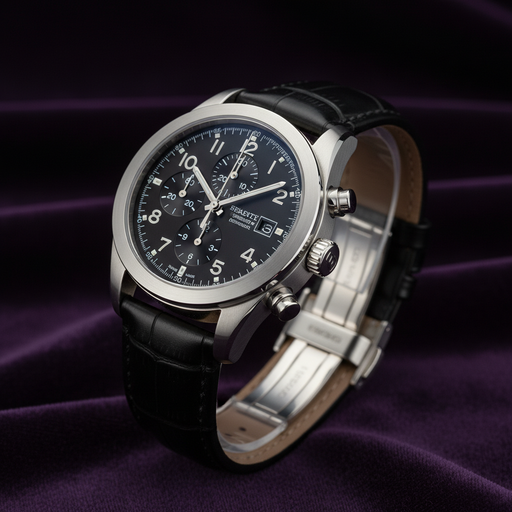 | **Luxury Watch**: A high-resolution, studio-lit product photograph of a premium stainless steel chronograph watch with black leather strap on a luxurious dark purple velvet backdrop with subtle reflections. The lighting is a three-point lighting with key light, fill light, and rim light, to eliminate harsh shadows while creating elegant highlights on the metal case. The camera angle is a three-quarter view from slightly above to showcase the intricate dial details and polished case finish. Ultra-realistic, with sharp focus on the watch face numerals and leather texture. Square 1:1 format for social media compatibility. |
| 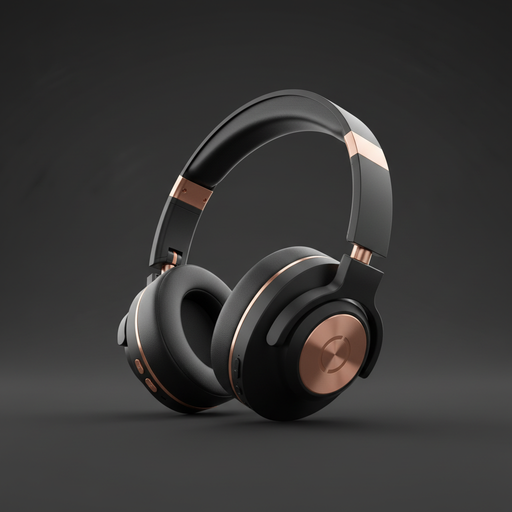 | **Premium Headphones**: A high-resolution, studio-lit product photograph of wireless over-ear headphones with matte black finish and rose gold accents on a clean white seamless background with subtle gradient. The lighting is a soft box lighting from the left with fill card on the right, to create even illumination while maintaining subtle shadows for depth. The camera angle is a straight-on hero shot at eye level to showcase the sleek design and premium materials. Ultra-realistic, with sharp focus on the headphone driver grills and cushion texture. Landscape 16:9 format for web display.                                 |
| 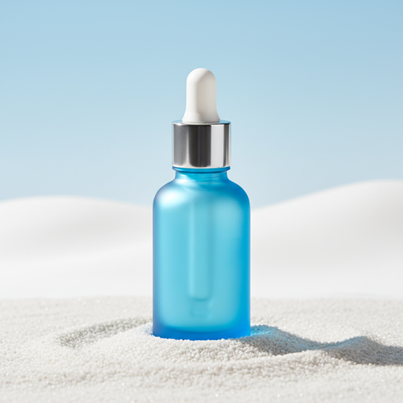 | **Artisan Coffee Beans**: A high-resolution, studio-lit product photograph of freshly roasted coffee beans scattered around an elegant glass jar with cork lid on a rustic wooden surface with warm ambient lighting. The lighting is a warm key light from above with subtle fill lighting, to create appetizing shadows and highlight the coffee bean texture and oil sheen. The camera angle is a 45-degree angle from above to showcase the coffee beans' rich color and the jar's transparency. Ultra-realistic, with sharp focus on individual coffee bean details and glass reflections. Square 1:1 format for social media compatibility.  |

### 4. Image Editing

#### In-Painting Examples

Change specific elements while preserving the original composition:

| Image                                                       | Prompt                                                                                                                                                                                                                                      |
| ----------------------------------------------------------- | ------------------------------------------------------------------------------------------------------------------------------------------------------------------------------------------------------------------------------------------- |
| 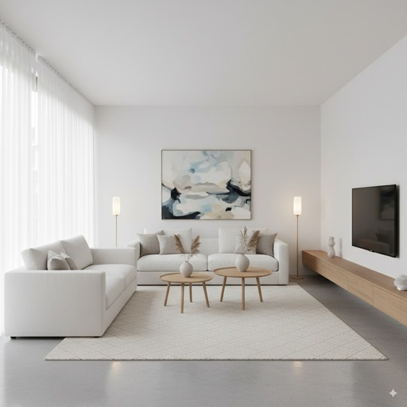        | **Original Image**: Source image for in-painting demonstration - a modern living room interior.                                                                                                                                             |
| 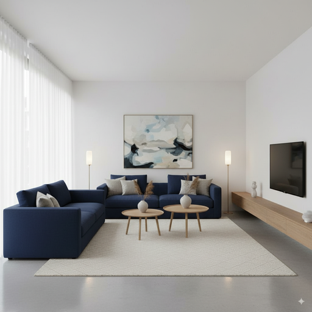 | **Sofa Color Change**: Using the provided image, change only the sofa to navy blue. Keep everything else in the image exactly the same, preserving the original style, lighting, and composition.                                           |
| 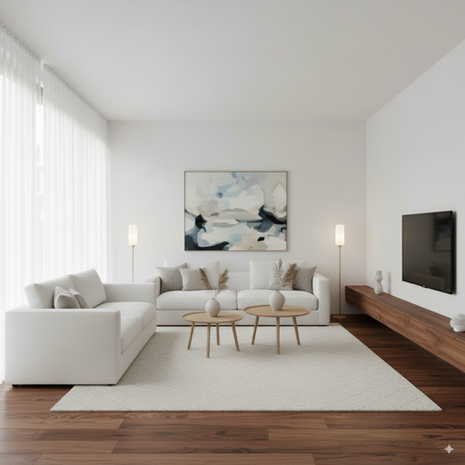 | **Alternative Sofa Variation**: Using the provided image, change only the sofa to a deep burgundy color with textured fabric. Keep everything else in the image exactly the same, preserving the original style, lighting, and composition. |

#### Image Combining

Combine elements from multiple images - showing the complete workflow from source materials to final composites:

| Image                                           | Description & Prompt                                                                                                                                                                                                                                                                                                                  |
| ----------------------------------------------- | ------------------------------------------------------------------------------------------------------------------------------------------------------------------------------------------------------------------------------------------------------------------------------------------------------------------------------------- |
| 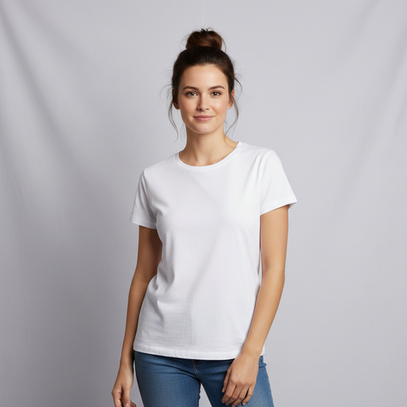    | **Source Model**: Base model image used for fashion compositing - professional model in simple white t-shirt and jeans against neutral background.                                                                                                                                                                                    |
| 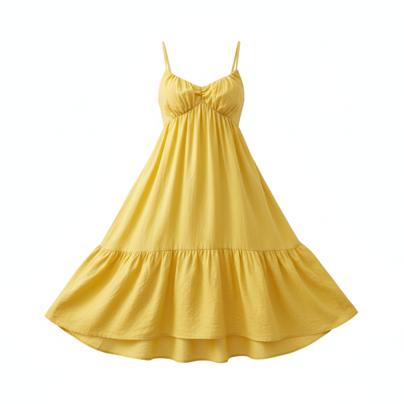 | **Source Outfit 1**: Yellow sundress - product photo on transparent background for compositing into model photos.                                                                                                                                                                                                                     |
| 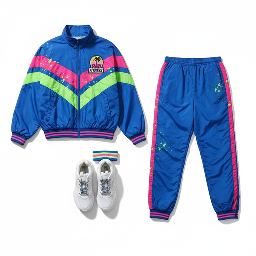 | **Source Outfit 2**: Retro athletic tracksuit set - complete outfit including jacket, pants, and sneakers for fashion composite demonstrations.                                                                                                                                                                                       |
| 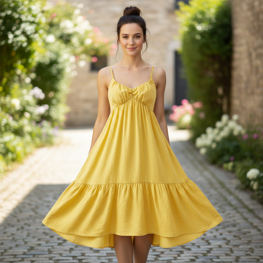 | **Fashion Composite Result 1**: Create a professional e-commerce fashion photo. Take the outfit from the first image and let the model from the second image wear it, well-fitted. Generate a realistic, full-body shot of the model wearing the outfit, with the lighting and shadows adjusted to match the outdoor environment.  |
| 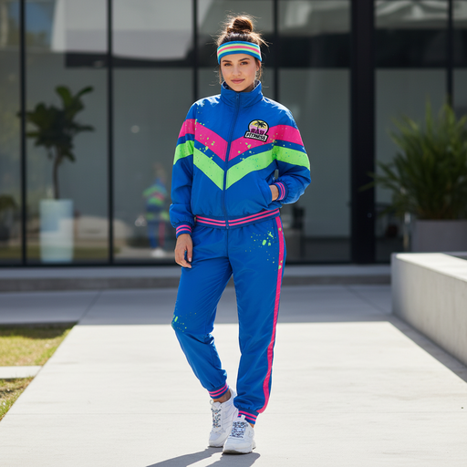 | **Fashion Composite Result 2**: Create a professional e-commerce fashion photo. Take the outfit from the first image and let the model from the second image wear it, well-fitted. Generate a realistic, full-body shot of the model wearing the outfit, with studio lighting and a neutral background for commercial photography. |

## Best Practices

### 1. Be Hyper-Specific

Generic vs. Detailed prompting comparison:

| Image                                                     | Prompt Type & Content                                                                                                                 |
| --------------------------------------------------------- | ------------------------------------------------------------------------------------------------------------------------------------- |
| 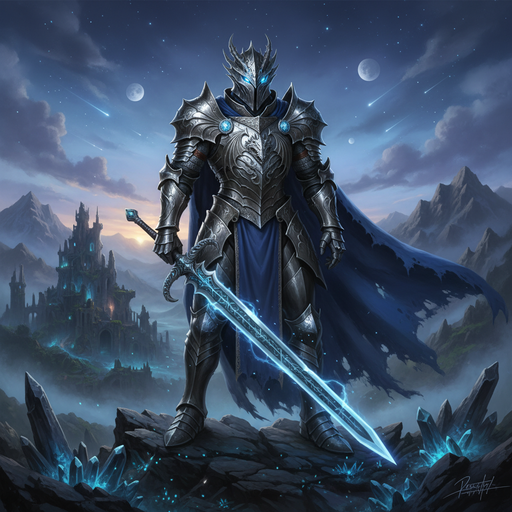    | **Generic**: "fantasy armor"                                                                                                          |
| 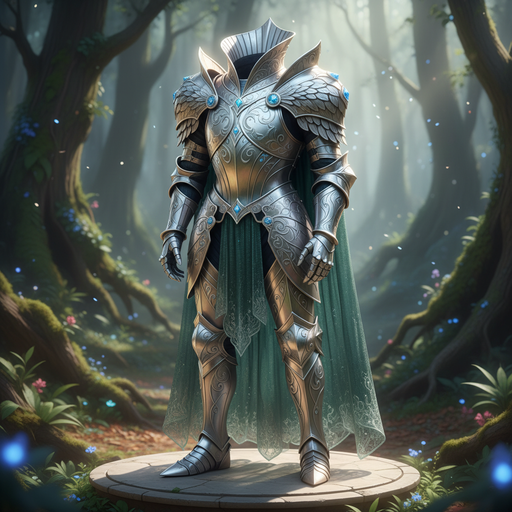 | **Detailed**: "ornate elven plate armor, etched with silver leaf patterns, with a high collar and pauldrons shaped like falcon wings" |

### 2. Provide Context and Intent

Basic vs. Contextual prompting comparison:

| Image                                     | Prompt Type & Content                                                           |
| ----------------------------------------- | ------------------------------------------------------------------------------- |
|       | **Basic**: "Create a logo for AURA"                                             |
|  | **Contextual**: "Create a logo for AURA, a high-end, minimalist skincare brand" |

### 3. Iterate and Refine

Use conversational refinement for perfect results:

| Image                                         | Iteration Step                                                                                     |
| --------------------------------------------- | -------------------------------------------------------------------------------------------------- |
| 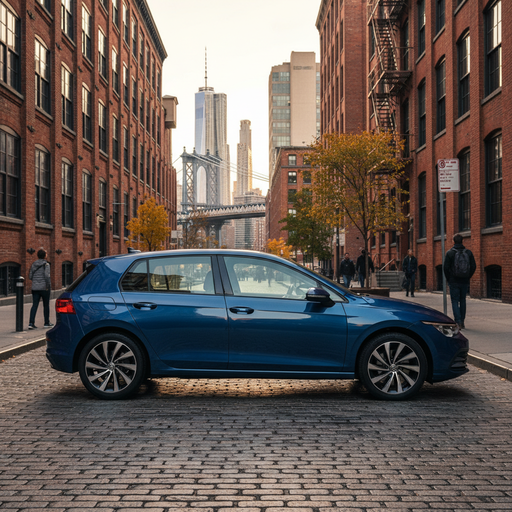 | **Step 1**: Basic scene - "A car parked on a street with trees in the background"                  |
| 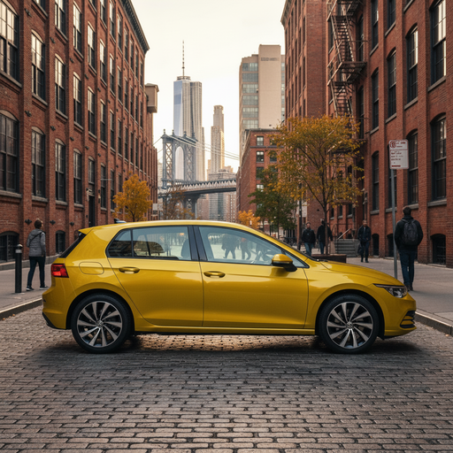 | **Step 2**: "Make the car bright yellow"                                                           |
| 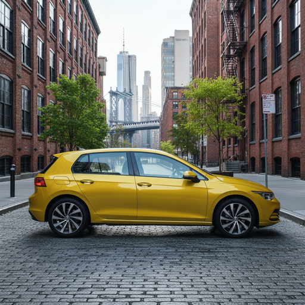 | **Step 3**: "Update the scene to have cooler, bright daylight, and make the trees more lush green" |

### 4. Use Step-by-Step Instructions

Break complex scenes into sequential steps:

| Image                                            | Approach                                                                                                                                                                                                                                              |
| ------------------------------------------------ | ----------------------------------------------------------------------------------------------------------------------------------------------------------------------------------------------------------------------------------------------------- |
| 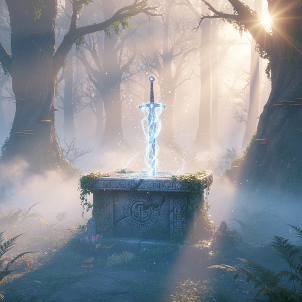 | **Single prompt**: "A magical glowing sword stuck on an ancient stone altar in a serene, misty, mystical forest at dawn."                                                                                                                             |
| 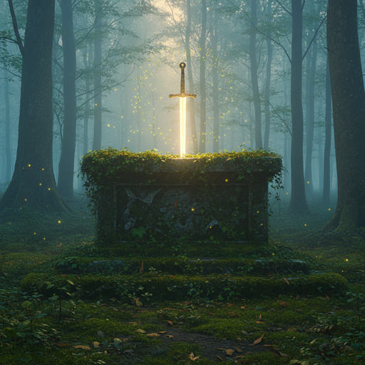 | **Step-by-step**: "First, create a background of a serene, misty forest at dawn. Then, in the foreground, add a moss-covered ancient stone altar. Finally, place a single, glowing sword stuck on the altar, surrounded by softly glowing fireflies." |

### 5. Control the Camera

Use photographic terminology for precise composition control:

| Image                                                     | Camera Technique                                                                                                         |
| --------------------------------------------------------- | ------------------------------------------------------------------------------------------------------------------------ |
| 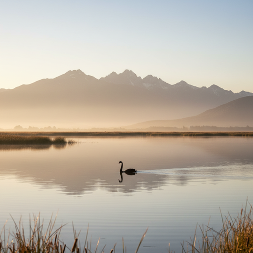   | **Wide-angle shot**: Ultra-wide 14mm lens capturing the entire scene with dramatic perspective and environmental context |
| 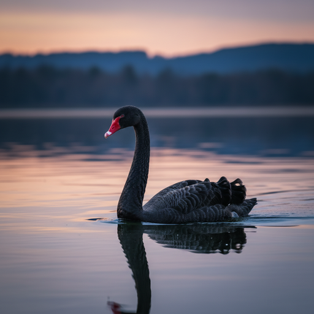 | **Medium shot with 70mm lens**: Standard portrait lens for natural perspective and subject isolation                     |
| 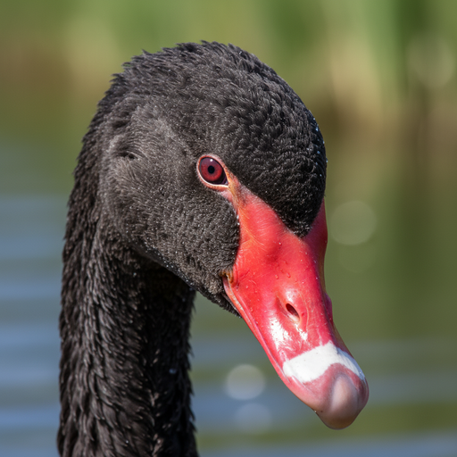  | **Macro lens extreme close-up**: 100mm macro lens for intricate detail capture and shallow depth of field                |

## Architecture

This workshop demonstrates:

- **Structured Prompt Templates**: Parameterized templates for consistent, high-quality outputs
- **Template Variables**: Strategic use of variables for different aspects (lighting, composition, style)
- **Image Input Pipeline**: Integration of reference images for editing and combining
- **Iterative Refinement**: Conversational approach to perfect image generation
- **Best Practice Patterns**: Proven techniques for reliable results

The `generate_image()` function handles the core Gemini API integration, while `display_image()` provides rich notebook visualization with metadata.
# nano-banana-prompt-guide
